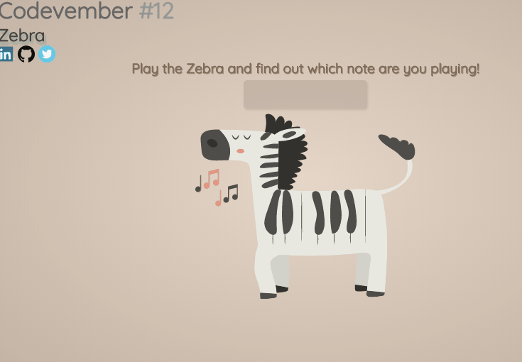

# Codevember 2017

## Day 12 - *Zebra*

Zebra with piano body!

You can see it working in [codepen](https://codepen.io/RominaMartin/full/LOyWoa/)

## Features:
- [x] Load piano notes
- [x] Show current note
- [x] Change color of piano key when active
- [x] Stop animation when user stops playing
- [ ] Music notes animations around the note playing

