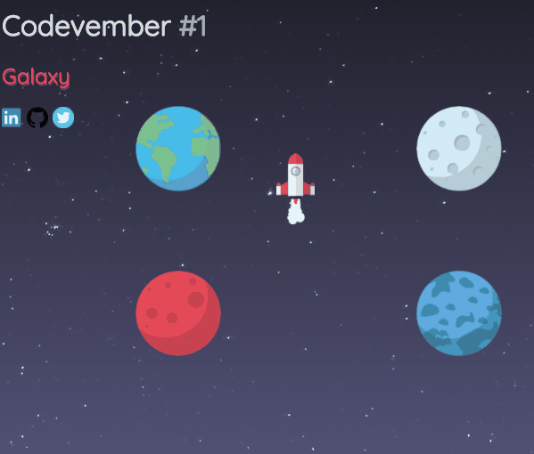

# Codevember 2017

## Day 1 - *Galaxy*

This is a rocket which moves between plantes.

You can see it working in [codepen](https://codepen.io/RominaMartin/full/YEyaoY/)

## Features:
- [x] Planets display
- [x] Move rocket
- [ ] Rocket rotation based on which planet is leading to.

